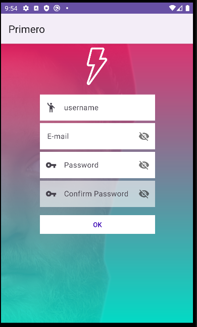

# App Rconnect

Este proyecto de Android fue una Actividad propuesta.

## Introducion
El codigo que se proporciona es la interaccion entre los activity se
encuentra Login, Resistro y Main. Login se abre primero para que se vea
las interaciones entre el Main. Registro solo retorna a Login. Main solo
tendra estilos y temas. Tanto Main y Register tendran la barra pero
Login no
## Lanzamiento
La app se ve de la siguiente manera:
Login lanza a Signup (Register)y al Main
Mi Signup 

# Main
Al darle al boton de login mi Main se veria de esta menera

# Estructura Final
Splash (es la parte principal de incio)
Cuenta con una animacion en el logo hace que se gire.
Tambien tiene un periodo de tiempo  para que aparezca el  Login

 En el login se hizo unas modifciaciones
 se cambio a la chica
 Luego cuando se le da a Login pasa a la pestaña a Main
 
 Al MAin cuenta con animaciones de tipo LottieAnimationView  
 solo los corazones hace que si te gusta cambia a Like y si no te gusta te cambia a como estaba anteriormente.  
  Luego la parte de arriba cuenta con un scrool horizontal
  No se añadio para que se pueda escribir algun comentario o algo
  Aparecen flechas donde te permite ir hacia adelante o hacia atras
  si le das hacia adelante te llevara a Nopeoble
  
  En este segmento te se añadio un swiperefresh y Toas que muestra un mensaje  
  Tambien hay una flecha que te permite volver atras.
  Si se vuelve a Login y se le da a SIGNUP
  En esta parte no se hizo cambios. Si se da a ok te vuelve al Login
  

